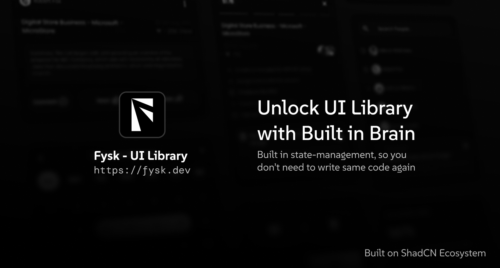

# Fysk



**Fysk** is a next-generation UI component library designed for the modern web. Unlike traditional libraries, Fysk components come with a "built-in brain" - they aren't just static pixels; they manage their own specific local states and interactions out of the box.

Built on top of **Radix UI** and **Tailwind CSS**, Fysk prioritizes premium aesthetics and developer experience, distributed via a generic "copy-paste" architecture similar to shadcn/ui.

---

## ✨ Features

- **Built-in Brain**: Atoms handle their own micro-interactions (e.g., a button that have success, loading, error state and behave based on state automatically).
- **Premium Aesthetics**: Polished, high-end visual design defaults that look great immediately.
- **Copy-Paste Architecture**: You own the code. Copy components directly into your project and customize them without fighting a package abstraction.
- **Universal Theming**: seamless support for Light/Dark modes, compatible with both Tailwind v3 and v4.
- **Bleeding Edge**: Built for React 19 and Next.js 16.

## 🚀 Tech Stack

- **Framework**: Next.js 16 (Turbopack)
- **Library**: React 19
- **Styling**: Tailwind CSS
- **Primitives**: Radix UI
- **Package Manager**: pnpm

## 🛠️ Development

This repository is a Monorepo managed by **Turborepo** and **pnpm**.

### Prerequisites

- Node.js 18+
- **pnpm** (Required)

### Quick Start

1. **Clone the repository:**

```bash
git clone https://github.com/ameghcoder/fysk.git
cd fysk
```

2. **Install dependencies:**

```bash
pnpm install
```

3. **Run the development server:**

```bash
pnpm dev
```

This will start the documentation site at `http://localhost:3000`.

## 📂 Project Structure

- `apps/web`: The documentation and examples website (Next.js).
- `fysk`: The core component library source.
- `packages/core`: Core utilities and scripts.
- `registry`: Generated registry files for component distribution.

## 🤝 Contributing

We welcome contributions! Please ensure you use `pnpm` for all package management commands to respect the lockfile.

## 📄 License

This project is open source and available under the [MIT License](LICENSE).
